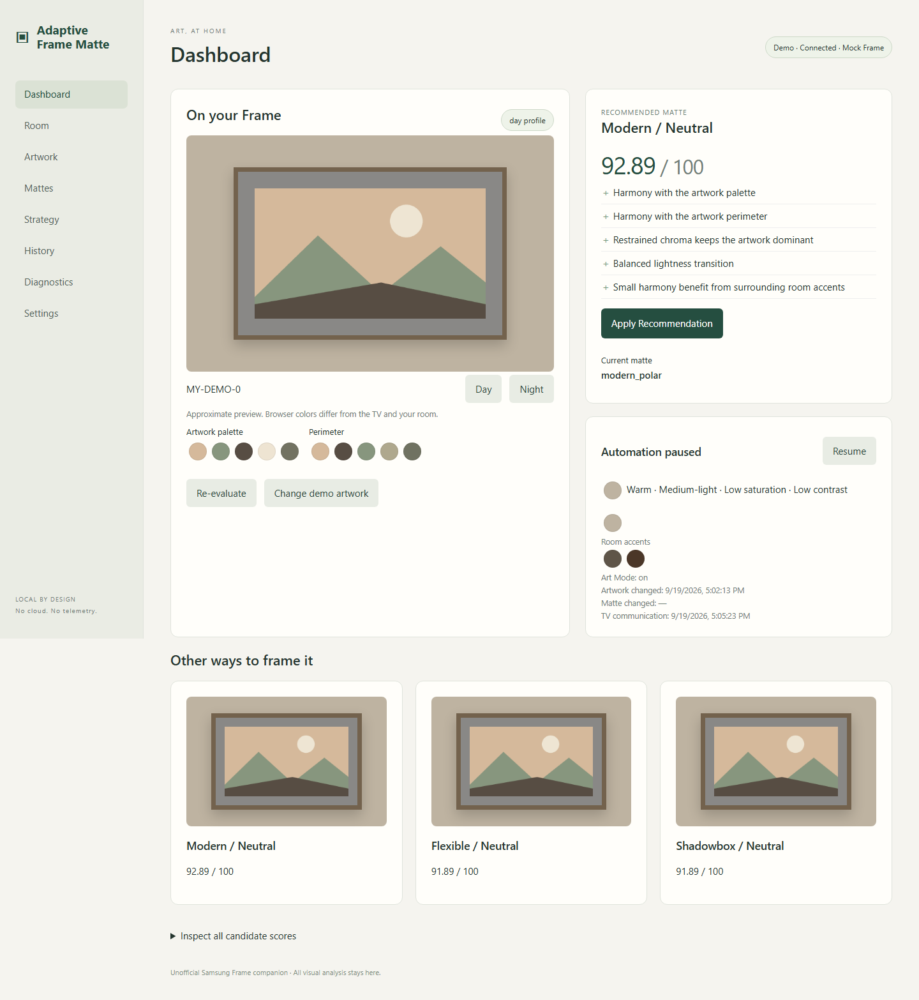

# Adaptive Frame Matte

A local, self-hosted companion that chooses a supported Samsung Frame matte to suit
the current artwork and the measured appearance of your room, by day and by night.
One Python application, one container, no cloud AI.



Designed for phone setup and daily use: [mobile dashboard](docs/mobile.png),
[mobile setup](docs/mobile-setup.png), and [touch wall-mask editor](docs/mobile-mask.png).
These screenshots use generated demo artwork and a synthetic room photograph.

**Unofficial project. Not affiliated with Samsung.** This uses existing local Art
Mode interfaces, never custom firmware. Samsung firmware/API behavior can change.
All visual analysis is local. Samsung artwork is not redistributed, Art Store
source files are not downloaded, and no DRM or authentication is bypassed.

## What it does

- Discovers Samsung TVs through SSDP or an explicit private subnet; pairs locally.
- Runs multiple TVs independently with separate pairing, room profiles, settings,
  caches, overrides and history. A per-tab TV selector keeps controls scoped.
- Queries the device's matte families/colors, including RGB when the TV reports it.
- Analyzes thumbnails in CIELAB with CIEDE2000 and a separate 12.5% perimeter palette.
- Scores every enabled candidate, explains the result, and previews the top three.
- Estimates day/night room appearance from ordinary phone photos, automatically
  finding the TV and nearby wall. Optional reference calibration improves confidence.
- Reacts to supported artwork websocket events with a 10-second polling fallback.
- Re-evaluates unchanged artwork when room profiles, settings or overrides change.
- Offers Adaptive, Subtle, Contrast and Gallery strategies, neutral bias, hysteresis,
  cooldowns, force-matte overrides and Never Modify.
- Persists pairing, preferences, room calibration, cached analysis and history in SQLite.

Automation starts **paused**. It only writes while Art Mode is actively displaying,
rechecks the content ID immediately before applying, and verifies API readback.
It never powers on the television, changes volume or normal picture settings.

## Quick start

Requires Docker/Compose and a Samsung Frame on a reachable trusted LAN.

```sh
git clone https://github.com/JohnLHolloway/adaptive-frame-matte.git
cd adaptive-frame-matte
mkdir -p data
sudo chown 10001:10001 data
docker compose up -d --build
```

Open **http://YOUR_SERVER_IP:8787/setup**. On Windows Docker Desktop, create the
directory normally; Linux ownership commands are for Linux hosts.

The service runs as UID/GID **10001**, listens on port **8787**, drops Linux
capabilities, writes only to `/data`, and exposes `/healthz` for its healthcheck.
The Compose restart policy is `unless-stopped`. The healthcheck reports application
health, not TV availability; a sleeping TV is not a container failure.

## First-run setup

1. **Find your Frame.** Try discovery, enter a private `/24` subnet if multicast
   is blocked, or enter the TV's IPv4 address. Only Samsung service ports are used.
2. **Pair.** Click Connect and press **Allow** on the television if prompted.
   Tokens are saved under `/data/tokens`, never rendered in the browser or logged.
3. **Capabilities.** Read model/API, Art Mode state, current artwork and advertised
   mattes. While Art Mode is on, Re-evaluate attempts thumbnail acquisition.
   Diagnostics distinguishes observed events and unverified physical behavior.
4. **Snap the room.** Upload an ordinary phone photo; wall sampling is automatic.
   Night calibration can be added later. Choose a timezone and switching schedule.
5. Check the recommendation, manually apply it, then resume automation when ready.

Setup is always available at **Settings → Run setup wizard**. Changing TVs does
not require deleting the database; automation is paused when switching devices.

## Just snap a room photo

The normal phone workflow is **take/upload a photo → automatic TV detection and
wall sampling → saved room profile**. Include the whole TV and some surrounding
wall from your normal viewing position. The TV can keep playing a movie; this
workflow sends no commands to it. Take a separate photo under nighttime lighting
later. No wall painting or tracing is required.

OpenCV scores screen-shaped quadrilaterals from frame edges, then proposes wall
samples above and beside the TV. Texture/color outliers are excluded. Review the
result if desired; an optional overlay shows what was sampled. If the detector
cannot confidently find the TV, tap its four corners and sampling proceeds
automatically. Severe angles, occlusions, portrait-mounted TVs and multiple similar
rectangles can require this fallback. This is geometry, not semantic scene understanding.

Ordinary snapshots provide **as-photographed appearance**, not camera-corrected paint
color. Exposure and white balance remain unknown; confidence is capped at 60%, and
no ambient color-cast measurement is claimed without a reference. An advanced wall
editor remains available only to correct mistakes. Manual HEX input is also optional.

## Optional guided reference calibration

Start while Art Mode is already on. The application journals the original artwork,
uploads its own 3840×2160 reference image, and displays it with no matte when
advertised. The fallback matte is recorded. Automation pauses during calibration.

The pattern contains four distinct ArUco fiducials, neutral grays, black/white,
original sRGB color patches, warm/cool neutrals, saturation samples and a large
neutral field. It is not a copied ColorChecker chart.

Photograph the whole television and substantial surrounding wall from your normal
viewing position. Use normal daytime lighting. Upload JPEG, PNG or WebP, up to
20 MB / 40 megapixels. The app strips metadata, detects screen corners, corrects
perspective, samples known patches, fits a regularized affine color transform and
checks held-out patch error. Screen pixels are excluded from wall measurement.

Optionally review **Correct wall selection**: green pixels are sampled, other pixels are excluded.
Paint wall areas, erase furniture/windows/plants/adjacent walls, or reset automatic
selection. A robust color/texture filter proposes the initial mask; it is not a
semantic wall detector. Saving the mask recalculates the profile.

Profiles store wall LAB, lightness, chroma, warmth, observed brightness, estimated
ambient cast, surrounding/neutral palettes, contrast, variability, patch error
and confidence. Descriptions such as “Warm · Medium-light · Low saturation” derive
from these measurements, not an LLM's aesthetic opinion.

Room decorations are analyzed separately from the wall. Their accent palette has
a small adjustable influence (default at most ±2.5 score points); set it to zero
to ignore seasonal decorations. Movie/art pixels are excluded. Embedded color
profiles are converted to sRGB. See [color methodology](docs/COLOR_METHOD.md) for
the measurement limits and scoring details.

**Limits:** phone auto white balance, HDR, tone mapping and screen emission differ
from reflected wall light. This reduces errors; it does not provide colorimeter
accuracy or absolute lux. Confidence is a heuristic capped at 90%, not a statistical
probability. Manual profiles have lower confidence. Manual wall masking matters.

Finish calibration to restore the original artwork, provided the user has not
selected another artwork. Removing calibration art is a separate action restricted
to recorded, fingerprinted, application-owned assets for the same configured TV.
No arbitrary artwork deletion API is exposed. Interrupted sessions persist and
continue to suspend automation until finished.

Repeat at night under normal room lighting. Fixed schedules, manual Day/Night
selection and locally calculated sunrise/sunset are supported. Approximate latitude,
longitude and timezone are optional user input; no location service is contacted.
Polar sunrise/sunset calculation failures fall back to the fixed schedule. If an
active profile is missing, recommendations wait for it instead of inventing data.

## Recommendations and artwork

**TVs & discovery** adds another TV or opens discovery for the selected one. Each
configured TV has its own persistent connection and watcher; switching the UI does
not pause other TVs. Existing single-TV installations migrate as **My Frame** without
moving or deleting their data. Additional TVs live under `/data/tvs/<id>`. One TV
address cannot be assigned to two controllers in the same installation. Up to 16
TVs can be configured; only one physical TV was available for live validation.

The Artwork library has server-side search, behavior filters and 24-item pages;
it does not transfer every artwork's analysis with each dashboard refresh. Images
load lazily. Mattes defaults to grouped **Colors**, with **Styles** and individual
**Combinations** views, search, style filters and bounded pages. Color or style
preferences can be changed as a group.

Samsung controls which matte colors and styles the physical TV can render. An
arbitrary HEX color or width in millimeters cannot be sent through this API. Custom
measured color values calibrate a supported color's local appearance and scoring;
they do not create new TV colors. Border width and built-in shadow depth are chosen
through the supported style (thin, wide, shadowbox, etc.). Browser previews vary
width and show shadowbox inset depth, but are schematic; exact dimensions, material,
lighting and multi-panel layouts are not reproduced.

Adaptive defaults: 30% perimeter harmony, 25% wall separation, 15% artwork palette,
10% room harmony, 10% lightness balance, 10% restrained chroma. Advanced weights
are editable for Adaptive; other strategies have deliberate presets. Color scoring
dominates the small style adjustments. Saturated candidates incur an additional
conservative penalty. Scores are heuristics, not scientific aesthetic judgments.

The default improvement threshold is 8 points with a 300-second cooldown. A new
artwork bypasses the time cooldown, but still respects score improvement. Identical
artwork/profile/settings do not trigger repeated writes. Force overrides still obey
Art Mode safety and cooldown. **Never Modify also blocks manual Apply Recommendation.**

Image acquisition tries a TV thumbnail, a locally supplied reference, then cache.
Cache keys include content ID and image fingerprint. Normal TV-provided `SAM-*`
thumbnails may be analyzed locally when the firmware exposes them. No original
Art Store files are requested. When thumbnails fail, retain the current matte,
configure a supported safe default, supply your own local reference, or use an
artwork override. A low-resolution thumbnail is sufficient.

Some advertised matte family/color combinations are incompatible with particular
artwork dimensions. Readback failures appear in History and do not count as success.
Disable unsuitable candidates in Mattes. Device-reported RGB is preferred; otherwise
the app uses clearly labeled original nominal estimates that can be edited.

## Physical TV acceptance and discovery

Live development testing on a 2024 Frame verified pairing, Art API access,
current artwork/matte, the TV's matte catalog/RGB values, Art Store and personal-art
thumbnails, local analysis, and manual/automatic matte writes by API readback.
An independent client selection produced an `image_selected` event. Calibration
art uploaded and selected without a matte; generated assets were positively
identified and removed. Original artwork and both original matte values were restored.
Human observation confirmed that this TV requires re-selection of the current artwork
for the matte to visibly redraw; its device setting was saved accordingly. Other TVs
still require their own visual test. Remote-button event testing, actual reference-pattern
room photography, overnight unattended operation and TrueNAS installation remain
separate checks. See [the validation record](docs/VALIDATION.md).

Firmware quirks isolated in the adapter include personal IDs with `MY_` or `MY-`,
uppercase default matte IDs, and selection acknowledgement preceding current-artwork
readback. Some firmware couples the two reported matte orientations; sending both
fields in a normal change can instead ignore the landscape value. The acceptance
probe records and restores both values explicitly. Independent portrait presentation
is not currently a recommendation feature.

The first live deployment step is this acceptance probe, with automation paused:

Pairing is performed through Samsung's local authorization channel without sending
remote keys. Moving to another host may require a fresh authorization even when the
previous token was migrated. Use **Setup → Connect to this Frame** and press Allow
on the television when prompted; tokens are stored locally and never shown in the UI.

```sh
# Native installation
python scripts/frame_probe.py --discover
python scripts/frame_probe.py --discover --subnet YOUR_PRIVATE_SUBNET/24
python scripts/frame_probe.py --ip YOUR_TV_IP --data-dir ./data
# Only while Art Mode is displayed; asks for physical redraw observations.
python scripts/frame_probe.py --ip YOUR_TV_IP --data-dir ./data --write-test --observe-seconds 30

# Or use the running container (persistent token and reports under /data):
docker compose exec adaptive-frame-matte python scripts/frame_probe.py --ip YOUR_TV_IP --write-test
```

The write probe journals original content/matte/state, uses an advertised same-family
alternative, reads back, asks whether the screen redrew, optionally reselects, then
restores in `finally` and verifies both matte fields. Do not exit the probe or change
TV modes mid-test. If the mode/content changes externally, it refuses to wake the TV
or override the user's selection; its private recovery report identifies unfinished
restoration. No software can guarantee restoration after power/network failure.

Enable **Settings → Re-select current artwork after matte changes** only after
physical observation confirms that it is required. An API readback cannot establish
whether physical pixels redrew. For event testing, change artwork with the remote
during the observation period. Diagnostics lists events actually observed.

## Network requirements

The container needs access to TV TCP 8001 (device information), TCP 8002 (paired
secure websocket), and the TV-negotiated D2D transfer port for thumbnails/uploads.
The adapter validates the transfer host against the selected TV and bounds transfer
sizes/time. Samsung uses a self-signed local TLS certificate.

Normal Docker bridge networking works for manual IP connectivity. SSDP multicast
UDP 1900 may not cross Docker/network boundaries. On a Linux host, optionally use:

```sh
docker compose -f compose.host.yml up -d --build
```

Host networking is not mandatory. Do not run both Compose variants simultaneously.
Guest Wi-Fi isolation, VLAN rules and sleeping TVs can prevent discovery. mDNS is
not required because Samsung's local service is discoverable by SSDP/IP.

## TrueNAS SCALE

Use a Docker-based SCALE release with Compose available. Do not install Python or
modify the TrueNAS base OS. Create dedicated datasets for the checkout and app data;
replace `POOL` below with your actual pool name. The data dataset must allow UID/GID
10001 to traverse and write (adjust dataset ACLs in TrueNAS if required).

```sh
sudo mkdir -p /mnt/POOL/apps/adaptive-frame-matte /mnt/POOL/appdata/adaptive-frame-matte
sudo chown 10001:10001 /mnt/POOL/appdata/adaptive-frame-matte
sudo chmod 700 /mnt/POOL/appdata/adaptive-frame-matte
cd /mnt/POOL/apps/adaptive-frame-matte
sudo git clone https://github.com/JohnLHolloway/adaptive-frame-matte.git .
printf 'FRAME_DATA_PATH=/mnt/POOL/appdata/adaptive-frame-matte\nFRAME_MOCK_TV=false\n' | sudo tee .env >/dev/null
sudo docker compose up -d --build
sudo docker compose ps
```

Open **http://YOUR_SERVER_IP:8787**. Pair from Setup; choose a timezone in Room.
The entire persistent state lives in `/mnt/POOL/appdata/adaptive-frame-matte`.
Use ZFS snapshots/backups of that dataset. For a portable SQLite backup, stop the
container before copying the whole data directory (including WAL files).

For Apps UI management, TrueNAS supports **Install via YAML** and external Compose
`include`. After creating the checkout and `.env`, use an absolute include path in
the Apps editor, then let Apps manage the service instead of starting a duplicate
shell-managed stack. See [TrueNAS custom app documentation](https://apps.truenas.com/managing-apps/installing-custom-apps/).

```yaml
include:
  - path: /mnt/POOL/apps/adaptive-frame-matte/docker-compose.yml
    env_file: /mnt/POOL/apps/adaptive-frame-matte/.env
```

Update a shell-managed installation without deleting data:

```sh
cd /mnt/POOL/apps/adaptive-frame-matte
sudo git pull --ff-only
sudo docker compose up -d --build
```

Do not run `down -v` or delete the data dataset during upgrades. The database is
schema-versioned. Future incompatible schema changes will require explicit migration.

## Development and mock mode

```sh
python -m venv .venv
. .venv/bin/activate
pip install -e '.[dev]'
FRAME_DATA_DIR=./data FRAME_MOCK_TV=true uvicorn app.main:app --port 8787
ruff check .
pytest
docker build -t adaptive-frame-matte:local .
```

PowerShell: set `$env:FRAME_DATA_DIR='./data'` and `$env:FRAME_MOCK_TV='true'`, then
run Uvicorn. Mock mode has original generated landscapes, a synthetic `SAM-DEMO`
thumbnail, matte changes and artwork events. Use the dashboard to change demo art
and Day/Night buttons to simulate profile transitions. Tests exercise a redraw quirk.
No physical integration test runs in CI; the `live` marker is excluded by default.

The Samsung adapter is the only module importing samsungtvws. The selected
[Frame-focused async fork](https://github.com/NickWaterton/samsung-tv-ws-api) provides
persistent event dispatch; the maintained [upstream](https://github.com/xchwarze/samsung-tv-ws-api)
and [contemporary HA integration](https://github.com/billyfw/frame-art-shuffler) were
evaluated during development. See [THIRD_PARTY_NOTICES.md](THIRD_PARTY_NOTICES.md).

The container includes the exact unmodified LGPL library source at
`/usr/share/adaptive-frame-matte/samsungtvws-source.tar.gz`. Keep that source and its
license available when redistributing the image. Application source is MIT.

## Troubleshooting and limitations

- **Disconnected:** verify the selected IP, local routing, TV authorization, and
  Samsung network settings. Re-run Setup. Reconnect uses bounded backoff.
- **Art Mode off:** expected during normal TV use; no writes occur. Never turn on
  the TV merely to satisfy the watcher.
- **Thumbnail unavailable:** firmware/Art Store restrictions or D2D connectivity
  can prevent retrieval. Configure the explicit fallback; do not bypass restrictions.
- **Write not verified:** the family may not support that artwork, or firmware may
  require re-selection. Check with the opt-in physical probe, then configure the quirk.
- **Photo markers missing:** include all four corners, avoid glare, fill more of
  the camera frame with the TV, and display the reference image without cropping.
- **Implausible wall measurement:** correct the mask, avoid clipped exposures,
  repeat under normal lighting, or use a manual profile. Confidence is approximate.
- **No matte options:** refresh capabilities. The application does not invent a
  Samsung matte list if the device query fails.
- **Events absent:** polling remains available. Older Art APIs and all Frame
  generations are not yet physically verified. No SmartThings dependency is used.
- **Ambient sensor:** no reliable measured local lux reading was established;
  brightness-setting APIs are not treated as ambient sensor measurements.
- Advanced automated photographic calibration of every matte is not implemented;
  editable swatches provide the v1 adjustment path.
- This service manages one active television per data directory. Photo-based
  reference calibration and uploads have mock/synthetic tests; ordinary snapshot
  detection was also checked locally against a private room photo (not published).
  Physical end-to-end testing
  remains required. The app has no authentication and assumes a trusted LAN.

## Privacy, security, and contributing

No telemetry, analytics, external fonts, CDNs, cloud AI or photo uploads to other
services. Pairing tokens, photos, databases, `.env` and `/data` are ignored by Git.
CSRF tokens, same-origin writes, bounded image decoding, private-IP validation,
restricted media paths and controlled ownership checks protect local operations.
**Do not expose this UI directly to the public internet.** Use an authenticated VPN
or reverse proxy if remote access is needed. Protect backups as private data.

Issues and contributions are welcome. Include model/API version and sanitized
errors, never tokens, MAC addresses, private device names, room photographs or raw
databases. Add focused tests for behavior changes, run Ruff/pytest and the privacy
audit, and document which checks were mock versus physical. CI builds the container
after tests; it never contacts your television. See [CONTRIBUTING.md](CONTRIBUTING.md).

Sunrise/sunset switching supports one shared offset from -360 to +360 minutes. For example, +30 starts Day 30 minutes after sunrise and Night 30 minutes after sunset; negative values switch earlier. Configure approximate coordinates and timezone under Room or Settings. Calculations stay local; the fixed schedule is the fallback when solar events cannot be calculated.

The Room and Settings pages include an offline nearby-city picker (Astral’s bundled city catalog). Selecting a city fills approximate coordinates and timezone; Save schedule enables Auto mode. No geocoding service receives searches. Smaller towns can use a nearby city or manual coordinates.

Recommendations offer **Apply once** or **Always use for this artwork**. The latter saves an artwork override; return it to Automatic on the Artwork page to resume adaptive choices. Both actions recheck the current artwork and Art Mode, honor Never Modify, and verify TV readback. Under Strategy, **Only recommend this style** keeps a chosen native border style while adapting its color.

The everyday interface keeps frame style, room photos and recommendations up front. Enable **Settings → Show advanced controls** for numeric scoring, custom appearance calibration, combination-level preferences and diagnostics. This display preference is remembered in the current browser; it does not change automation settings.
